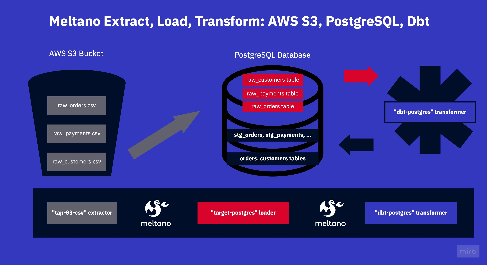

# Meltano Example Projects: Extract & Load (EL) (Jaffle Shop) Sandbox
This project extends the ```jaffle shop``` sandbox project created by [DbtLabs](https://github.com/dbt-labs/jaffle_shop) for the data built tool ```dbt```. This meltano project sources one CSV file from AWS S3 and puts them into one table inside a Postgres database.


## What is this repo?
_What this repo is:_

A self-contained sandbox meltano project. Useful for testing out scripts, yaml configurations and understanding some of the core meltano concepts.

_What this repo is not:_

This repo is not a tutorial or an extensive walk-through. It contains some bad practices. To make it self-contained, it contains a AWS S3 mock, as well as a dockerized Postgres database. 

We're focusing on simplicity here!

## What's in this repo?
This repo contains an ```AWS S3``` mock with one CSV file inside. The raw customer data.

The meltano project extracts this CSV using the tap-s3-csv ```extractor```, and loads them into the ```PostgreSQL``` database using
the loader ```target-postgres```.


## How to run this project?
Using this repository is really easy as it all runs inside docker via [batect](https://batect.dev/), a light-weight wrapper around docker. 

### Run with batect
We [batect](https://batect.dev/) because it makes it possible for you to run this project without even installing meltano. [Batect requires Java & Docker to be installed to run](https://batect.dev/docs/getting-started/requirements). 

The repository has a few configured "batect tasks" which essentially all spin up docker or docker-compose for you and do things inside these containers.

Run  ```./batect --list-tasks ``` to see the list of commands.

```./batect launch_mock``` for instance will launch two docker containers one with a mock AWS S3 endpoint and one with a postgres database.

Batect automatically tears down & cleans up after the task finishes.

### Run the project

1. Launch the mock endpoints in a separate terminal window ```./batect launch_mock```.

2. Launch meltano with batect via ```./batect melt```.
2.1. Alternatively you can use your local meltano, installed with ```pip install meltano```. (The mocks will still work.)

3. Run ```meltano install``` to install the two plugins, the S3 extractor and the PostgreSQL loader as specified in the [meltano.yml](new_project/meltano.yml).

Here is an extract from the [meltano.yml](new_project/meltano.yml):

```yaml
...
plugins:
  extractors:
  - name: tap-s3-csv
    variant: transferwise
    pip_url: pipelinewise-tap-s3-csv
    config:
      bucket: test
      tables:
        - search_prefix: ""
          search_pattern: "raw_customers.csv"
          table_name: "raw_customers"
          key_properties: ["id"]
          delimiter: ","
      start_date: 2000-01-01T00:00:00Z
      aws_endpoint_url: http://host.docker.internal:5005
      aws_access_key_id: s
      aws_secret_access_key: s
      aws_default_region: us-east-1

  loaders:
  - name: target-postgres
    variant: transferwise
    pip_url: pipelinewise-target-postgres
    config:
      host: host.docker.internal
      port: 5432
      user: admin
      password: password
      dbname: demo
```

4. Finally, run ```meltano run tap-s3-csv target-postgres``` to execute the extraction and loading. 

5. Check inside the local database afterwards to see that your data has arrived, use the connection data below.

```yaml
...
      host: localhost
      port: 5432
      user: admin
      password: password
      dbname: demo
```

